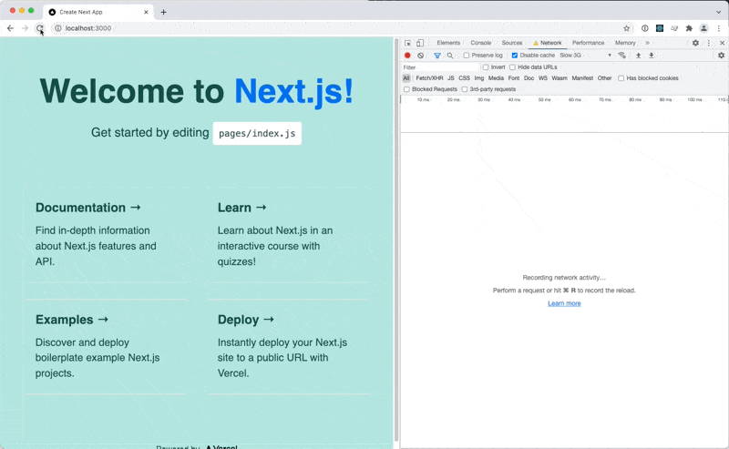

# Reproduction for a FOUC issue when using different versions of styled-jsx

## Steps to reproduce

- Install dependencies: `yarn install`
- Build example project: `yarn workspace @ynsjf/example build`
- Start example project: `yarn workspace @ynsjf/example start`
- Open browser at http://localhost:3000
- After each refresh see FOUC

